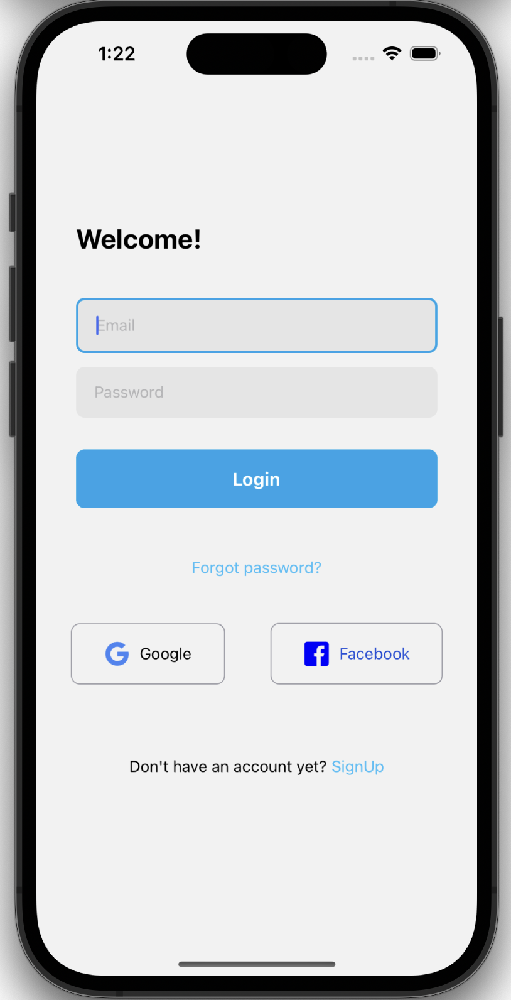
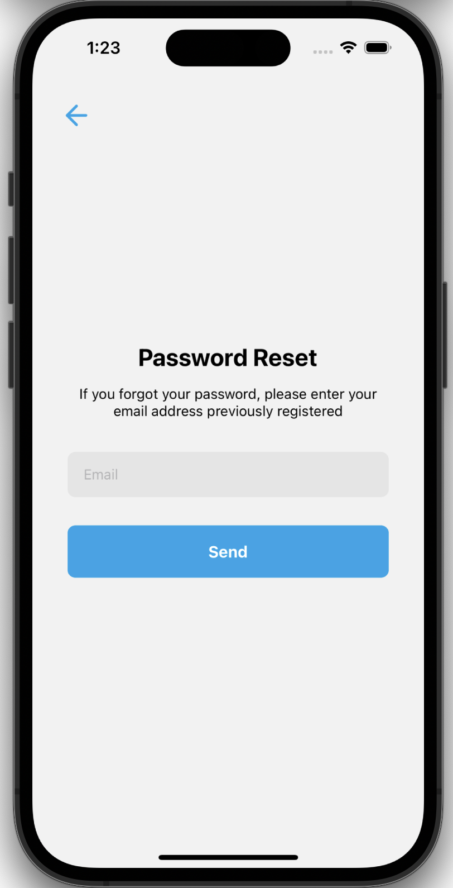
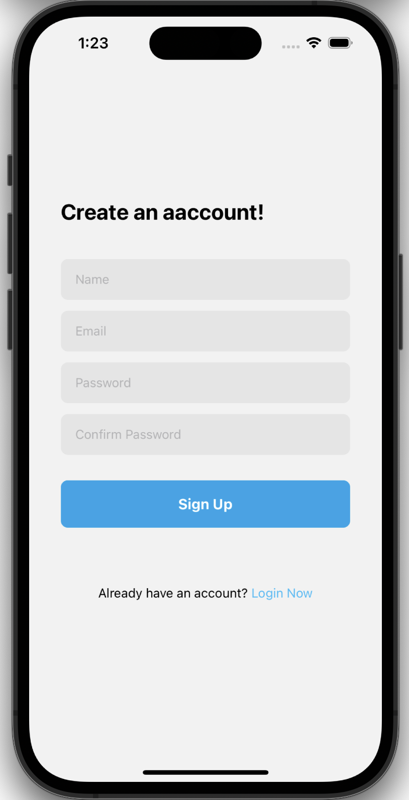

<h1> Login Screen </h1>

🇺🇸 This application was developed in JS/TS with React-Native framework, the main objective of this application is to create a basic template for login/sign up of any application, with the possibility of adding more functions in other future applications

<h2 align=center font="bold"> App Screenshots 📸 </h2>

      
    
    

